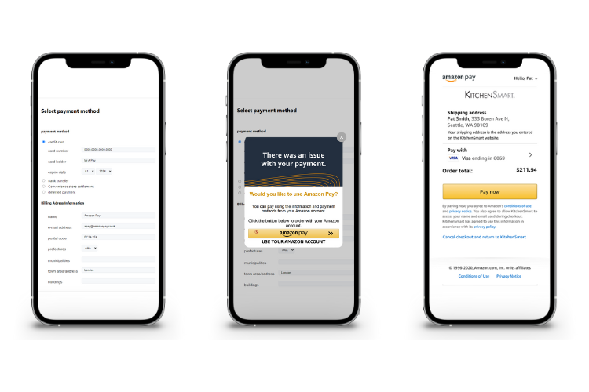

# Amazon Pay Cart Recovery

Amazon Pay Cart Recovery provides buyers with an easy alternative checkout method, after their card is declined, in your standard checkout.

This guide provides an overview of the buyer experience, and provides a sample integration, to demonstrate how to integrate the solution with your website.

## The Amazon Pay Cart Recovery Checkout Experience

1. The buyer starts checkout in your standard flow, enters their shipping and billing information, then attempts to pay with a payment instrument (not Amazon Pay).
2. If their payment method is declined, your website presents a decline message to the buyer.
3. Amazon Pay Cart Recovery presents an alternative checkout method to the buyer, in a pop-up window.
4. Once clicked, the buyer is directed to the Amazon Pay hosted page where they can review their shipping address (entered on step 1) and select their preferred payment method from their Amazon Pay wallet.
5. The buyer completes checkout on the Amazon Pay-hosted page.
6. If prompted, the buyer can respond to multi-factor authentication (identity validation) challenges, or select another payment method if their payment is declined.
7. Amazon Pay redirects the buyer back to your confirmation page.



## Integration steps

In this repository, there are two files that will help you to integrate Amazon Pay Cart Recovery with your website:

* remedial_bbap_sample.html

This is an example of the HTML that you will need to include on the page you wish to integrate Cart Recovery.
The Amazon Pay button utilizes the ‘end of checkout’ placement. Please refer to the documentationfor the different parameters.

* amazonpayAssist_en.js

This is an example of the JavaScript required to launch the Amazon Pay Cart Recovery pop-up window. You will need to host the JavaScript file, in order to be referenced in the HTML.

## Pop-up render time

The ‘fadeIn’ attribute sets the time (in seconds) between the page render, and the pop-up render. We recommend a value of 3.

```
        amazonpayAssist('AmazonPayButton', {
            type: 'card'
        }).fadeIn(3);

```


